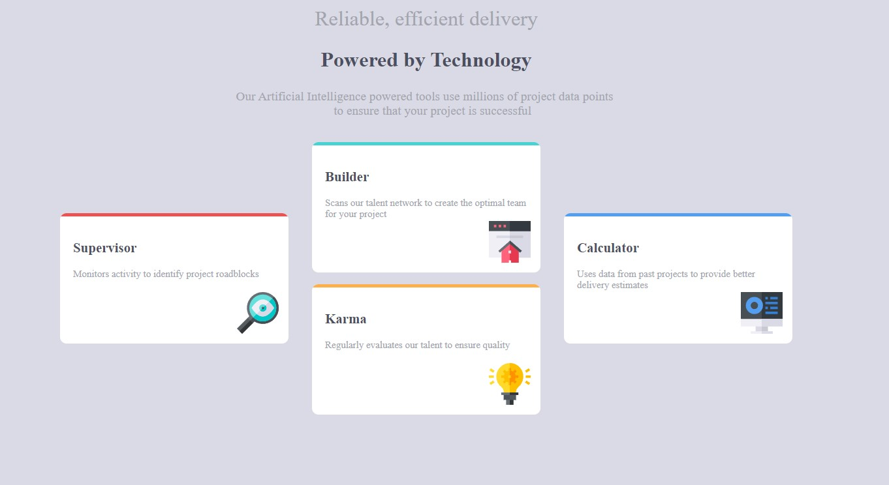

# Frontend Mentor - Four card feature section solution

This is a solution to the [Four card feature section challenge on Frontend Mentor](https://www.frontendmentor.io/challenges/four-card-feature-section-weK1eFYK). Frontend Mentor challenges help you improve your coding skills by building realistic projects. 

## Table of contents

- [Overview](#overview)
  - [The challenge](#the-challenge)
  - [Screenshot](#screenshot)
  - [Links](#links)
  - [Built with](#built-with)
  - [What I learned](#what-i-learned)
  - [Author](#author)
- [Acknowledgments](#acknowledgments)

## Overview

### The challenge

Users should be able to:

- View the optimal layout for the site depending on their device's screen size

### Screenshot

### Links

- Solution URL: [Github Code Repo](https://github.com/ShaunPour/Four-Card-Feature-Section)
- Live Site URL: [Live Site](https://shaunpour.github.io/Four-Card-Feature-Section/)

### Built with

- Semantic HTML5 markup
- CSS custom properties
- Flexbox

### What I learned

As it turns out, stuff like this that wants me to position elements in an unorthodox manner (a plus shape rather than a straight line or something) is something I still have trouble with. It took me some time yet to work out I needed to put an extra div around two particular elements to get it to go + shaped rather than just be a straight line.

## Author

- Website - [Shaun Pour](https://shaunpourdev.com)
- Frontend Mentor - [@DarkPhoenixNinja92](https://www.frontendmentor.io/profile/DarkPhoenixNinja92)

## Acknowledgments

I want to give a special thanks to my favorite coding youtubers: Coder Coder (AKA Jessica Chan), Code Creative and SelfTaughtDev for their amazing tutorials. While they don't do walkthroughs on this particular project, the concepts they cover in their videos played a big part in inspiring me to keep pushing forward and reach this point as a developer.
